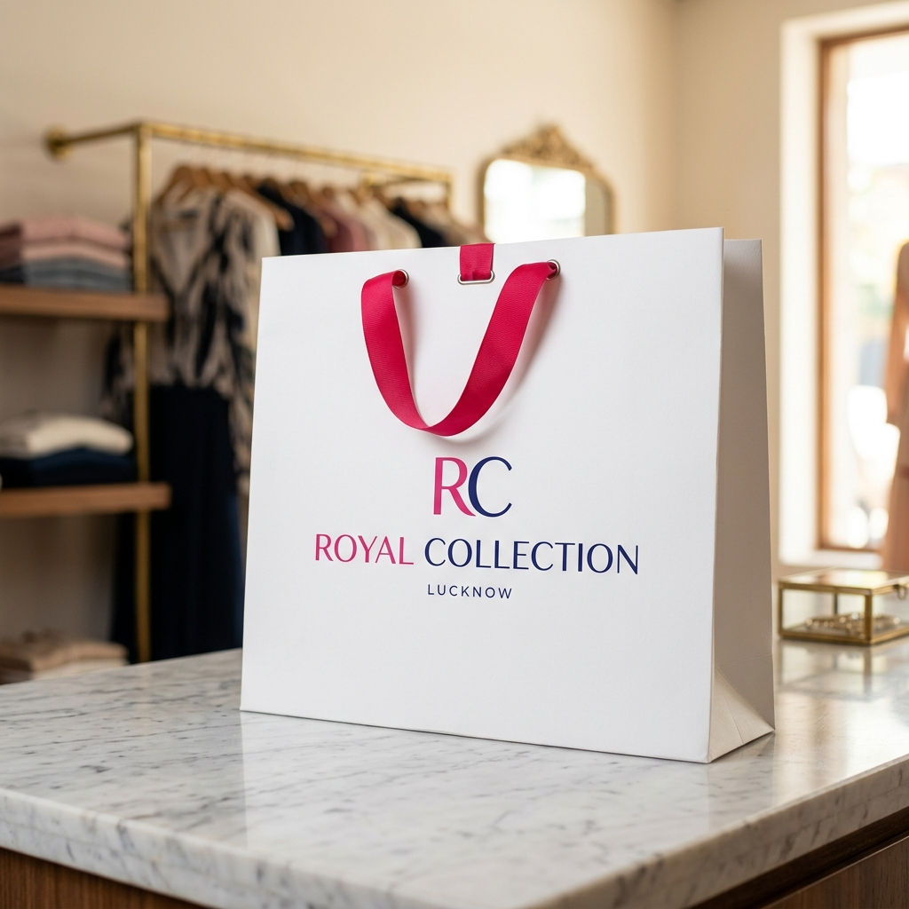

# ROYAL COLLECTION — Lucknow Fashion Store

A modern, mobile-first, single-page ecommerce web application and owner product management platform for **ROYAL COLLECTION (Lucknow)**.



---

## 🌟 Brand Information

- **Business Name:** ROYAL COLLECTION
- **Brand Mark:** RC
- **Location:** Shri Nagar Colony, Mohibullapur, Madiyaon, Lucknow, Uttar Pradesh
- **Phone Numbers:** +91 7007326371 / +91 8574553890
- **Instagram:** [@ROYAL_COLLECTION_LUCKNOW](https://instagram.com/ROYAL_COLLECTION_LUCKNOW)
- **Categories:** Jeans, Shirts, T-Shirts, Jackets, Shoes, Watches, Belts, Other
- **Official Store Policy:** **NO REFUND • ONLY EXCHANGE WITHIN 2 DAYS**

---

## 🚀 Key Features

### 1. Customer Storefront
- **Top Announcement Bar:** Official Lucknow location and 2-Day Exchange policy banner.
- **Sticky Responsive Header:** RC monogram, navigation shortcuts, search focus, wishlist indicator, cart counter badge, and mobile drawer menu.
- **Hero Showcase:** 2-column layout on desktop, mobile-first stacked design with animated typography, CTAs, and editorial menswear imagery.
- **Deals In Categories Grid:** Visual category cards with product counters and quick-filter navigation.
- **Product Catalog & Live Filter:** Search by product name, category, or description with price sorting and category pills.
- **Product Cards:** Responsive grid (1–2 cols on mobile, 3 on tablet, 4 on desktop) with hover animations (`y -4`, image zoom), badges (`NEW`, `DEAL`, `POPULAR`, `LIMITED`), crossed-out sale prices, and quick-view actions.
- **Product Quick View Modal:** Image gallery thumbnails, size selection, color chips, quantity adjusters, policy badge, and direct WhatsApp inquiry.
- **Shopping Bag (Cart Drawer):** Slide-in drawer with item counters, subtotal in ₹, and **WhatsApp Direct Checkout** pre-populating order details for the Lucknow store desk.
- **Deals In Store Section:** Dedicated promotional section showcasing products marked as deals or discounted.
- **Style from Lucknow Story:** Heritage & contemporary fashion narrative featuring the official Royal Collection boutique shopping bag reference.
- **Store Visit Desk:** Address details, direct `tel:` calling links, Google Maps directions, and Instagram handle.
- **Exchange Policy Section:** Clean, professional presentation of the 2-Day Exchange policy.
- **Responsive Footer:** Complete sitemap, store hours, contact info, and owner portal quick link.

### 2. Owner / Admin Product Management (LocalStorage Powered)
- **Separate Owner Dashboard:** Easily toggled from the navbar or footer.
- **Inventory Insights & Metrics:** Summary cards for Total Products, Featured Items, Active Deals, and Out of Stock alerts.
- **Product Upload Form:**
  - Product Name, Category dropdown, Price (₹), Sale Price (₹), Description, Badge, Stock, Sizes, and Colors.
  - Image Upload with **client-side auto-compression** to Data URL to ensure snappy LocalStorage persistence.
  - Live drag/drop & file input preview with filename, compressed file size, replace, and remove buttons.
  - Integrated Unsplash sample image picker.
  - Validation feedback on all required fields.
- **Inventory Management:**
  - Search & filter owner inventory.
  - Responsive desktop table and stacked mobile cards.
  - **Edit Product:** Seamlessly update existing items.
  - **Delete Product:** Delete with confirmation modal.
  - **Reset Demo Data:** Restore curated Royal Collection demo items with one click.

---

## 🛠️ Technology Stack

- **React 19** (JavaScript only, No TypeScript)
- **Tailwind CSS v4** (`@tailwindcss/vite`)
- **Framer Motion** for scroll reveals, modal transitions, and micro-interactions
- **Browser LocalStorage** (`royal_collection_products`)
- **Unsplash API Service** with offline fallback imagery

---

## 📦 Getting Started

1. **Install dependencies:**
   ```bash
   npm install
   ```

2. **Start the development server:**
   ```bash
   npm run dev
   ```

3. **Build for production:**
   ```bash
   npm run build
   ```

---

## 📱 Mobile Responsiveness

The application is engineered mobile-first and tested for:
- 320px (Compact devices)
- 360px & 375px (iPhone SE & standard smartphones)
- 390px, 414px, 430px (Modern flagship smartphones)
- 768px & 820px (iPads & tablets)
- 1024px, 1280px, 1440px+ (Laptops & large desktop monitors)
